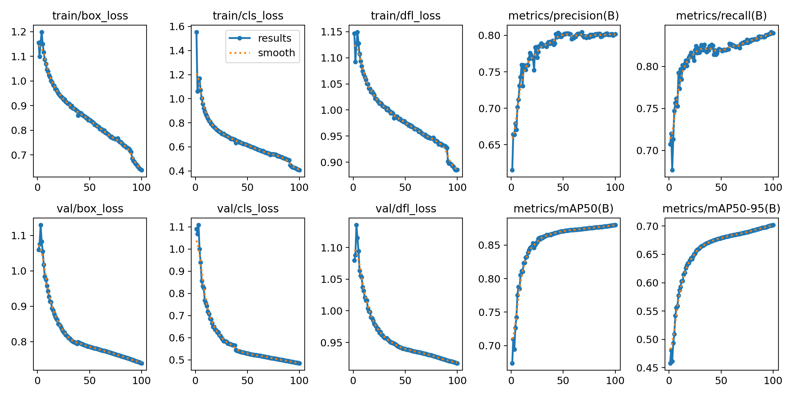
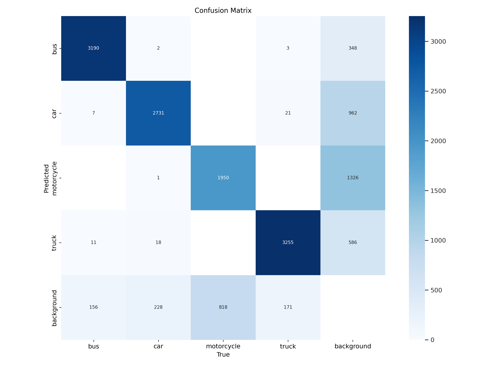
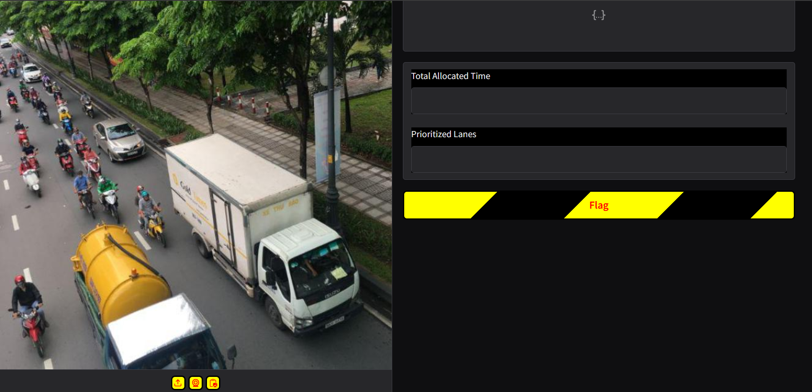
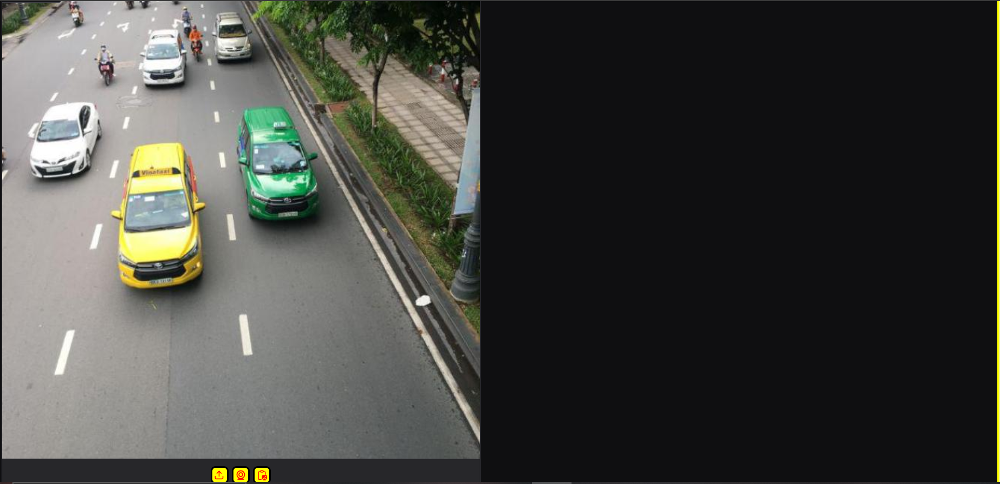
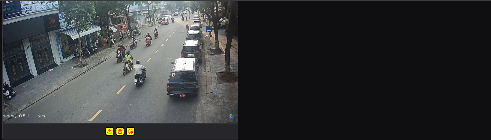
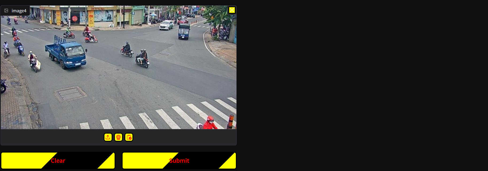
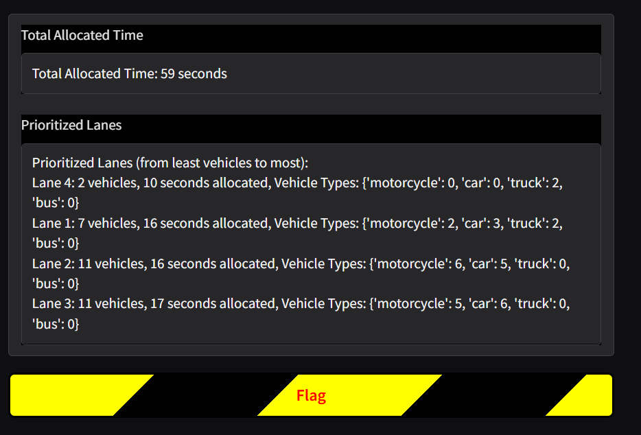

# Computer Vision 👁️ for Intelligent Traffic 🚦 Monitoring and Control
This repository contains the implementation of my research titled [_"Computer Vision for Intelligent Traffic Monitoring and Control"_](https://www.irejournals.com/paper-details/1706535), published in Iconic Research And Engineering Journals (2024) authored by [Rizama Victor](https://github.com/Rizama-Victor) and [Prince Abiamamela Obi-Obuoha](https://github.com/MelaObuoha) at the National Centre for Artificial Intelligence and Robotics (NCAIR), Nigeria.

---

## 🧭 Overview
Conventional traffic systems struggle to adapt to changing road conditions which continues to be a major issue due to the rising number of vehicles causing congestion and longer travel times amongst other limitations of the current traffic control systems. This project focuses on the development of an Intelligent Traffic Light Management System that uses computer vision to adjust signal timings in real time based on actual traffic density in a bid to reduce wait times and improve the overall traffic flow efficiency.

---

## 🎯 Research Objectives

-  To curate a high-quality dataset of different vehicle types specifically at traffic intersections.
-  To develop a computer vision model capable of accurately detecting and classifying vehicles across multiple traffic lanes in real-time.
-  To count the number of vehicles in each lane based on the real-time detection results.
-  To dynamically adjust signal timing by assigning shorter waiting periods and longer green light durations to lanes with higher traffic density.

---

## 🧰 Tools and Technologies Used

| Tool/Libraries | Purpose in the Project |
|--------------------|-----------------------|
| Python | Used as the main programming language for developing and training the computer vision model, and the algorithm. |
| OpenCV | Used for handling images, image processing, and video frame extraction. |
| YOLOv8 | Implemented for real-time vehicle detection and classification. |
| Ultralytics | Provided the implementation of YOLO used for both training and inferencing with the YOLO-based model for the real-time vehicle detection and classification. |
| Pytorch | Used for model training and performance evaluation. |
| TorchVision | Used for running the YOLO model and performing the inferencing process. |
| Gradio | Used for creating a Graphical User Interface (GUI) the model integration nad simulation of the CCTV surveillance. |
| Google Colab | Provided the virtual environment and computational resources such as GPU support for running and training the model. |
| Roboflow | Used for hosting the dataset and performing data pre-processing. |
| LabelImg       | Utilized for dataset annotation/labelling.                                   |
| Display | Used for displaying inferenced images, training results and test images in the program notebook. |
| Image | Used for creating python objects representing an image. |
| Shutil | Used for high-level image file operations. |
| CSV | Used for for reading and writing to .txt files. |
| Codecs | Used for manipulation of video data. |

---

## 🧠 Model Building and Development

### Data Collection and Preparation
Initially, a collection of 4 datasets was used to form a complete collection of 12,088 images of traffic lanes was obtained containing various classes ranging from _"buses", "cars", "motorcycle", "fire truck", "van", "pedestrians", "container truck"_ and _"bicycle"_ was gathered from Roboflow, an online computer vision platform for managing datasets and building computer vision Models.

### Labelling / Annotation
All four datasets were provided in the You Only Look Once (YOLO) format, with each image accompanied by its corresponding .txt file containing the labels. The respective classes for the 4 different Datasets included:
- **Dataset 1:** bus, car, motorcycle, and truck.
- **Dataset 2:** bus, container truck, fire truck, bicycle, car, motorcycle, truck and van.
- **Dataset 3:** bus, car, motorcycle, and truck.
- **Dataset 4:** bus, car, and truck.

### Data Cleaning and Structuring
To maintain consistency across the datasets, four main classes were defined: _"bus", "car", "motorcycle",_ and _"truck"_. This process involved removing irrelevant class labels, such as bicycle and van, from the .txt files associated with each image. Additionally, classes like container truck and fire truck were consolidated into the truck category by updating their class IDs. The techniques used during the data cleanng and structurig procedure include:

- **Deleting a Class Instance from .txt files:** This was used to removing irrelevant class labels such as _bicycle_ and _van_.
- **Modifying Class Ids to ensure Consistency:** This process involved consolidating similar classes into a single class. e.g classes like _container truck_, and _fire truck_ were combined into a single _truck_ class.
- **Removing Trailing Blank Lines Between Labels:** Following the modification of class IDs for consistency, it was observed that the write operation introduced extra blank lines in the label files. To resolve this issue, all .txt files were accessed to remove any additional blank lines present between the labels.
- **Deletion of Empty .txt Files:** After modifying the various classes, it was noticed that some .txt files were empty. As a result, all affected files, along with their corresponding .jpg files, were deleted to maintain a clean dataset.

### Data Pre-processing and Augmentation

#### Pre-processing Techniques

- **Auto-Orientation:** This ensured all images were displayed correctly regardless of their initial orientation during capture.
- **Image Resizing:** Resized Images to **640 X 640** pixels to align with YOLOv8 architecture for faster GPU training while retaining essential image details.

#### Augmentation Techniques

- **Horiontal Flips:** Flipped Images along the vertical axis to create mirrowed versions to enable the model recognize objects regardless of their left-to-right orientation.
- **Rotation:** Rotated images by a specifc angle of **+ or - 15 degrees**, generating new instances to further enable the model to recognize objects from different perspectives and orientations.

#### Train-Test-Validation Split

The train-test-validation split ratio of the dataset after pre-processing and augmentation was 80:10:10.

### Model Training

The training procedure for the model involved mounting the drive in the Google colab virtual environment, installing the ultralytics library, importing YOLO, importing the dataset from the Roboflow workspace, and finally training the model. The training time lasted for a total of 3.248 hours.

### 🤖 Model Summary
| Hyperparameter | Value |
|------------------------|---------------------------|
| Number of Epochs | 100 |
| Learning Rate | 0.01 |
| Image Input Size | 640 x 640 |
| Total Number of Classes | 4 |
| Batch Size | 16 |
| Activation Function | SiLU |
| Momentum | 0.937 |
|IoU Threshold | 0.7 |
| Optimizer | auto (AdamW at initial layers for early convergence and SGD at final layers for fine tuning) |

### Evaluation Metrics

| **Metric**      | **Value** | **Remarks**                                                                                                        |
| --------------- | --------- | ------------------------------------------------------------------------------------------------------------------ |
| **Precision**   | 0.774     | The model correctly identified most vehicles, with few false positives.                                            |
| **Recall**      | 0.894     | Indicated high sensitivity meaning the system successfully detected most vehicles in traffic scenes.               |
| **mAP@50**      | 0.893     | Demonstrated strong detection accuracy at a relaxed IoU threshold (50%), showing reliable recognition performance. |
| **mAP@50-95**   | 0.701     | Reflected consistent detection performance across multiple IoU thresholds, indicating robust model generalization. |
| **F1-Score**    | 0.830     | Balanced trade-off between precision and recall indicating overall strong detection reliability.                            |
| **Box Loss**    | 0.722     | Indicated a moderate box regression error but also suggesting some room for improving bounding box precision.      |
| **Object Loss** | 0.455     | Indicated effective object classification, with minimal misidentification during detection.                        |

### Results from Model Training

  
  
   
     
    <em> Fig 1: Detection Results for Different Lanes (Sourced from a Test Video) </em>

    
     
    <em> Fig 2: The Model's Result Summary</em>

    
     
    <em> Fig 3: Confusion Matrix</em>

## 📈 Model Integration

### GUI Implementation
As stated earlier, Gradio, an open source Python module, was used to create a Graphical User Interface (GUI) for implementing the traffic control model. The interface simulates CCTV surveillance by accepting four input images for Lane 1, Lane 2, Lane 3 and Lane 4. This is depicted in Fig.4 </em>)

### Traffic Prioritization Logic
 
 - **Emergency Vehicle Prioritization:** Input images passed into the model were processed for **emergency vehicle** detection and **IF DETECTED**, the lane with emergency vehicle is prioritized immediately and **IF NOT DETECTED**, the traffic density is calculated for each lane and the lane with the least traffic density is prioritized first.

### Commute Time Calculation
The commute time calculation involved computing the average time for each vehicle type, and summing across all detected vehicle types to get the total commute time per lane.

### Result from Model Integration

| Lane | Vehicle Detected | Count | Commute Time (Seconds) |
|------------------------|---------------------------|---------------------|-------------|
| Lane 4 | 2 cars | 2 | 10 |
| Lane 1 | 7 vehicles (cars, motorcycles, truck) | 7 | 16 |
| Lane 2 | 11 vehicles (motorcycles, cars) | 11 | 16 |
| Lane 3 | 11 vehicles (motorcycles, cars) | 11 | 17 |

From the table above, the total cyclic time was 59 seconds and the allocation of green light sequence would be from the lane with the lowest commute time to that with the highest commute time (In this scenario, Lane 4 → Lane 1 → Lane 2 → Lane 3).

  
  
   
  
   
     
    <em> Fig 4: Vehicle Detection and Lane Allocation Results on the Integrated Platform </em>

## 🔮Future Work
- Future research efforts should focus on enhancing the model’s accuracy, especially those capable of effectively handling visibility challenges under adverse weather condition.

## 📚 References
Obi-Obuoha A. , Rizama V.S. _"Computer Vision for Intelligent Traffic Monitoring and Control"_ Iconic Research And Engineering Journals Volume 8 Issue 5 2024 Page 392-405.
[Access the Full Paper](https://www.irejournals.com/formatedpaper/1706535.pdf)

## 📌 Note
Please kindly note that this README file is a summarized version of the full implementation of this research. The complete implementation can be accessed via the [program script](Computer_Vision_for_Intelligent_Traffic_Monitoring_and_Control.ipynb) and [interface implementation](Computer_Vision_for_Intelligent_Traffic_Monitoring_and_Contol-Gradio.ipynb). Dataset and Model Weights can be provided upon request.

